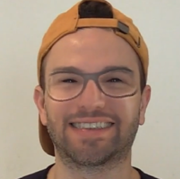

# DFAD 2023 - Challenge on DeepFake Analysis and Detection - Elsa Media Analytics

## Introduction
Code for the classifier used in the competition of Workshop and Challenge on DeepFake Analysis and Detection (DFAD 2023) organized during the International Conference on Computer Vision (ICCV 2023) in Paris. 

## Data augmentation
In order to ensure a good generalisation of the model, a very thorough data augmentation was carried out based on [1,4,7,8]. We have explored various ways of data augmentation, but the most complete and effective one is the one based on the following code inside deepfakes_dataset.py:

```
ImageCompression(quality_lower=40, quality_upper=100, p=0.1),
HorizontalFlip(),
GaussNoise(p=0.3),
ISONoise(p=0.3),
MultiplicativeNoise(p=0.3),
OneOf([
    IsotropicResize(max_side=size, interpolation_down=cv2.INTER_AREA, interpolation_up=cv2.INTER_CUBIC),
    IsotropicResize(max_side=size, interpolation_down=cv2.INTER_AREA, interpolation_up=cv2.INTER_LINEAR),
    IsotropicResize(max_side=size, interpolation_down=cv2.INTER_LINEAR, interpolation_up=cv2.INTER_LINEAR),
    CustomRandomCrop(size=size)
], p=1),
Resize(height=size, width=size),
PadIfNeeded(min_height=size, min_width=size, border_mode=cv2.BORDER_CONSTANT),
OneOf([RandomBrightnessContrast(), RandomContrast(), RandomBrightness(), FancyPCA(), HueSaturationValue()], p=0.5),
OneOf([Cutout(), CoarseDropout()], p=0.05),
ToGray(p=0.1),
ToSepia(p=0.05),
RandomShadow(p=0.05),
RandomGamma(p=0.1),
ShiftScaleRotate(shift_limit=0.1, scale_limit=0.2, rotate_limit=10, border_mode=cv2.BORDER_CONSTANT, p=0.5),
FFT(mode=0, p=0.05),
DCT(mode=1, p=0.5)
```

The image during training is then randomly transformed resulting in multiple variants:




## Architecture


We used different architectures in our experiments, but the one that proved to be the most effective was the Swin Transformer [5] architecture, as also previously seen in [3,6].


## Validation set
To validate the generalization capability of the trained model we constructed a custom validation set composed by 2500 pristine images (from Wikimedia, MSCOCO and FLICKR) and 2500 fake images (generated with StyleGAN, StyleGAN2, ProGAN, RelGAN, GLIDE and Stable Diffusion).

To construct the validation set use the code in [Detecting images generated by diffusers](https://github.com/davide-coccomini/Detecting-Images-Generated-by-Diffusers)[2] and download GAN images from [GANImageDetection](https://github.com/grip-unina/GANimageDetection) and then run the command:


```
python3 construct_validation_set.py
```

## Training

To train a model run the following command:

```
python3 train.py --config configs/architecture2.yaml
```

You can customize the following parameters for a specific training:
- --num_epochs: Number of training epochs (default: 60)
- --workers: Number of workers (default: 80)
- --resume: Path to the latest checkpoint (default: None)
- --training_csv: Path to the training CSV file
- --validation_csv: Path to the validation CSV file
- --models_output_path: Path to the folder in which you want to save the model checkpoints
- --max_images: Maximum number of images to use for training (default: all)
- --pre_load_images: To pre-load the images in memory or read them from folder during training
- --config: To specify a different yaml file
- --gpu_id: To specify GPU id (-1 for multi-gpu)
- --model: To specify the architecture (0: Cross Efficient ViT; 1: Resnet50; 2: Swin)
- --image_mode: To decide if apply DCT or not
- --efficient_net: To specify a different backbone in the case of Cross Efficient ViT architecture
- --patience: To specify how many epochs wait before stopping the training (default: 10)
- --random_state: Random state value (default: 42)

## Evaluation

To run the evaluation use the following command:

```
python3 test.py --config configs/architecture.yaml --model1_weights path_to_checkpoint --output_path output.json 
```

You can customize the following parameters for a specific evaluation:
- --workers: Number of workers (default: 80)
- --test_folder: Path to the test images
- --correct_labels_csv: Path to the labels csv file if available (e.g. to test on a custom test set)
- --output_path: Output to save json file containing the prediction
- --max_images: Maximum number of images to use for evaluation (default: all).
- --ensemble: To use multiple models for evaluation (if used, need to specify also the weights of the others models)
- --model1_weights: Weights for the first model (change the code properly to test a specific model)
- --model2_weights:  Weights for the second model (change the code properly to test a specific model)
- --model3_weights: Weights for the third model (change the code properly to test a specific model)
- --model: Model version (0: Cross Efficient ViT; 1: Resnet50; 2: Swin)
- --config: To specify a different yaml file
- --gpu_id: To specify GPU id (-1 for multi-gpu)
- --threshold: Fake/Pristine theshold (default: 0.5)
- --random_state: Random state value (default: 42)
- --error_analysis: Perform error analysis for custom test set if generation method is available


## Related Works

[1] Coccomini, D.A.; Zilos, G.K., Caldelli, R.; Falchi, F.; Amato G.; S. Papadopoulos; Gennaro, C.G. MINTIME: Multi-Identity Size-Invariant Video Deepfake Detection, Arxiv, 2022

[2] Coccomini, D.A.; Esuli A.; Falchi F.; Gennaro C.; Amato G. Detecting Images Generated by Diffusers

[3] Coccomini, D.A.; Caldelli, R.; Falchi, F.; Gennaro, C. On the Generalization of Deep Learning Models in Video Deepfake Detection. J. Imaging 2023, 9, 89.

[4] Giudice, O.; Guarnera, L.; Battiato, S. Fighting Deepfakes by Detecting GAN DCT Anomalies. J. Imaging 2021, 7, 128.

[5] Ze L., Yutong L., Yue C., Han H., Yixuan W., Zheng Z., Stephen L., Baining G.; Proceedings of the IEEE/CVF International Conference on Computer Vision (ICCV), 2021, pp. 10012-10022

[6] Coccomini, D.A.; Caldelli, R.; Falchi, F.; Gennaro, C. Cross-Forgery Analysis of Vision Transformers and CNNs for Deepfake Image Detection, MAD '22: Proceedings of the 1st International Workshop on Multimedia AI against Disinformation, 2022

[7] Coccomini, D.A., Messina, N., Gennaro, C., Falchi, F. (2022). Combining EfficientNet and Vision Transformers for Video Deepfake Detection. In: Sclaroff, S., Distante, C., Leo, M., Farinella, G.M., Tombari, F. (eds) Image Analysis and Processing – ICIAP 2022. ICIAP 2022. Lecture Notes in Computer Science, vol 13233. Springer, Cham.

[8] Guarnera, L.; Giudice, O.; Guarnera, F.; Ortis, A.; Puglisi, G.; Paratore, A.; Bui, L.M.Q.; Fontani, M.; Coccomini, D.A.; Caldelli, R.; et al. The Face Deepfake Detection Challenge. J. Imaging 2022, 8, 263.
